### 强化学习第一次作业

# **实验一**

实现梯度下降算法和Adagrad算法，完成GD.py和Adagrad.py的填空

 第一部分：梯度下降算法  学习率：0.0000001，迭代次数：100000

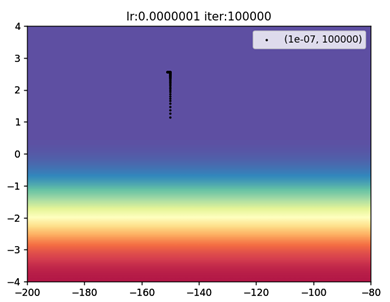

 这一部分的coding出现了一个小问题但是debug了很久，

​     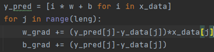
 最后发现是第一行的x_data写成了y_data，

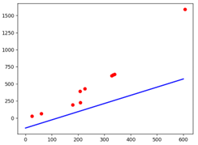

最后造成了斜率一直倾向于1，因为这样才能使损失函数下降，改正后结果正确

​     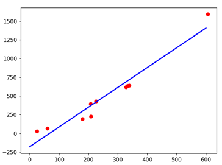

 **第二部分：*梯度下降算法 学习率：0.000001，迭代次数：100000

 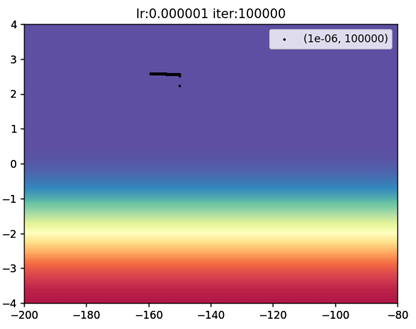

 **第三部分**：梯度下降算法  学习率：0.000001 迭代次数：500000

 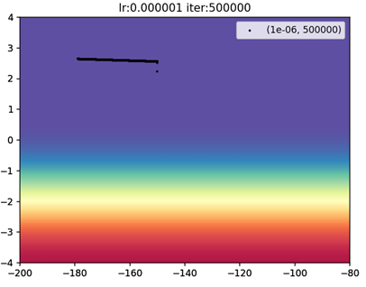

​     
 **第四部分 Adagrad****算法**  学习率：1，迭代次数：10000

 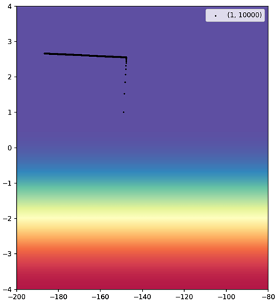

 这部分关键代码：

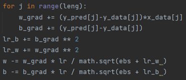

其中

 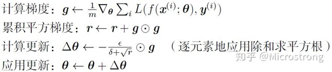

w_grad对应g，lr_w对应r

这部分在code时出现了没有使用r而3直接用  的情况，属于原理理解错误。

#  **实验二：**

实现采用MLP模型对mnist数据集进行分类，完成MLP_mnist.py的填空

这一部分直接使用MLPClassifier完成

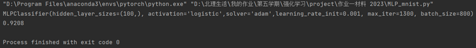

 **实验三**

 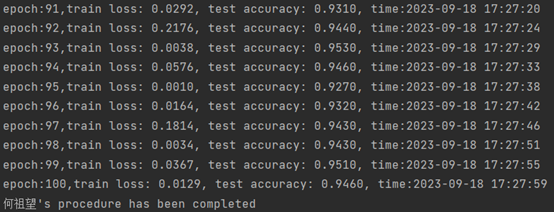

 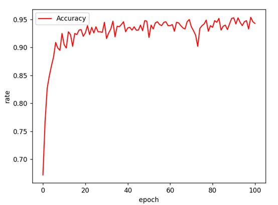

这一部分在一开始出现了mat1和mat2大小不一的情况，原因在于需要在卷积和全连接的连接处使用flatten

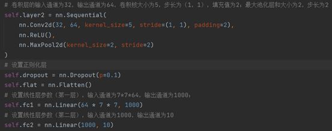

展平张量，0维(batch)保留，其余维数合一

# **开放性问题：**

 

**1.** **梯度下降算法和Adagrad**算法中参数设置对算法性能的影响；

 

训练轮数越大，训练效果越好，虽然如果有测试集的话，轮数过大会出现过拟合现象，但是本题只需要拟合给定的点，所以轮数越大效果越好。

学习率与拟合速度有关，一般学习率越大，拟合速度越快，因为学习率越大，模型参数向最优解方向逼近的速度越快。但是也不绝对，大的学习率会造成震荡，因为学习率过大会导致不断地跳过最优解，导致模型参数不断在最优解附近振荡，导致算法无法收敛。在最优解附近时，小的学习率有助于更快地使模型收敛。

adagrad算法使大学习率和小学习率取长补短，学习率能够随着训练的进行而自适应地减小，这样在在参数空间更为平缓的方向，会取得更大的进步，模型参数向最优解逼近的速度更快，而逼近最优解时，学习率会变小，这样避免了振荡现象的产生，使模型易于收敛。

 

**2. MLP**模型中学习率、隐藏层大小、训练轮次对模型性能的影响；

 

学习率：学习率决定了模型参数更新的步长。合适的学习率可以加快模型的收敛速度。如果学习率过大，可能会导致模型无法收敛；如果学习率过小，则需要更多的训练轮次才能达到收敛。

隐藏层大小：如果隐藏层太小，模型可能无法捕捉到数据中的复杂模式，导致性能不佳；如果隐藏层太大，可能会导致模型过拟合，即模型在训练数据上的性能很好，但在测试数据上的性能较差。

训练轮次：训练轮次决定了模型在数据集上迭代次数的多少。如果训练轮次太少，模型可能无法充分收敛，导致性能不佳；如果训练轮次太多，可能会导致过拟合，使模型在测试数据上的性能下降。

 

**3.** **尝试对CNN**模型中的激活函数、卷积层参数、池化层参数进行修改，并分析其影响。

 

原本的设置：

第一层：卷积层的输入通道为1，输出通道为32，卷积核大小为5，步长为（1，1），填充值为2，激活函数为ReLU；最大池化层和大小为2，步长为2。

第二层，卷积层的输入通道为32，输出通道为64，卷积核大小为5，步长为（1，1），填充值为2，激活函数为ReLU；最大池化层和大小为2，步长为2。

然后是正则化层，参数p=0.1。最后是两个全连接层。

 

**卷积层参数**

减小感受野，减小输入输出层数，模型精准度提高

 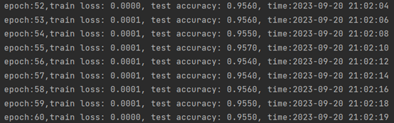
 增加一层全连接层，模型精度提升

 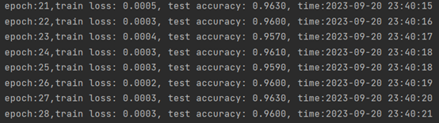
 换用sigmoid函数之后模型的收敛速度减慢

 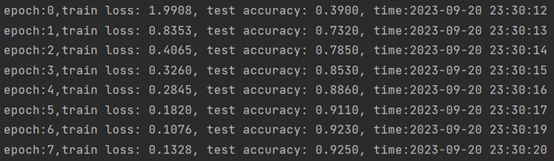
 经过充分训练后模型精准度和relu一样

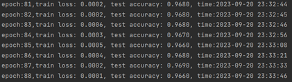
 relu的精度曲线不平缓

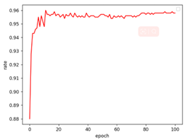
 而sigmoid曲线更为平缓

 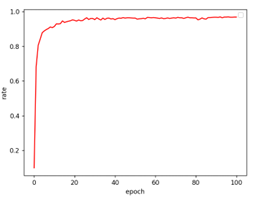

 取消池化之后模型训练速度减慢，但是精度没有更多提升

 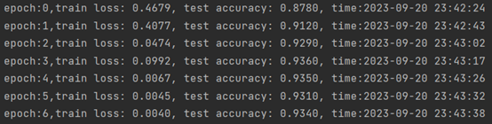

综上，池化参数目前较合理，可以显著加快训练速度。sigmoid函数在本任务中表现更为出色。由于图片分辨率很小，减小感受野，减小输入输出层数能提升性能。增加模型层数也能提升模型性能。

 